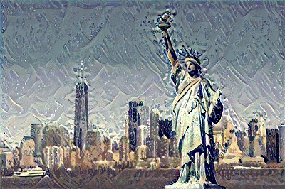
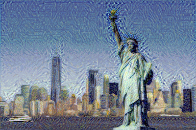

# Style Transfer with Deep Neural Networks

## Overview

This project implements neural style transfer using a pre-trained VGG19 convolutional neural network, based on the seminal paper by Gatys et al. The goal is to create a new image that combines the content of one image with the artistic style of another.



## Implementation Details

### Key Components
- **Base Model**: Pre-trained VGG19 neural network
- **Feature Extraction**: Extracting content and style features from specific convolutional layers
- **Optimization**: Adam optimizer to iteratively transform the target image
- **Loss Calculation**: 
  - Content Loss: Mean squared difference between content features
  - Style Loss: Gram matrix comparison across multiple style layers

### Hyperparameters and Experiments

#### Experimental Parameters
1. **Style Weights**
   ```python
   style_weights = {
       'conv1_1': 1.0,    # Larger artifacts
       'conv2_1': 0.8,    # Medium-scale features
       'conv3_1': 0.5,    # Intermediate features
       'conv4_1': 0.3,    # Finer details
       'conv5_1': 0.1     # Smallest scale features
   }
   ```

2. **Optimization Parameters**
   - Learning Rate: 0.003
   - Total Steps: 5000
   - Content Weight: 1
   - Style Weight: 1e6

#### Experiment Matrix

| Experiment | Content Weight | Style Weight | Style Layer Weights | Observations |
|-----------|----------------|--------------|---------------------|--------------|
| Baseline  | 1 | 1e6 | Default weights | Moderate style transfer |
| Exp 1     | 1 | 5e5 | Increased early layer weights | More prominent style artifacts |
| Exp 2     | 0.5 | 2e6 | Balanced layer weights | Subtle content preservation |
| Exp 3     | 2 | 5e5 | Reduced later layer weights | More content details |

## Visualization Strategy

### Intermediate Output Tracking
- Save output images every 500 iterations
- Track total loss progression
- Compare content, style, and final images side-by-side

### Performance Metrics
- Total Loss
- Visual Coherence
- Style Preservation
- Content Retention

## Potential Improvements
1. Dynamic learning rate scheduling
2. Perceptual loss refinement
3. Multi-scale style transfer
4. Experiment with different pre-trained models

## Challenges and Limitations
- Computationally expensive
- Sensitive to hyperparameter tuning
- Quality depends on content and style image characteristics

## Recommendations for Future Work
- Explore real-time style transfer techniques
- Style transfer on videos
- Implement adaptive style weight mechanisms


## Repository Structure
```
style-transfer/
│
├── notebooks/
│   └── style_transfer.ipynb
│   ├── content.jpg
│   └── style.jpg
│
├── outputs.jpg
│
└── README.md
```

## Setup and Reproduction
1. Install required dependencies
2. Prepare content and style images
3. Adjust hyperparameters as needed
4. Run the notebook


