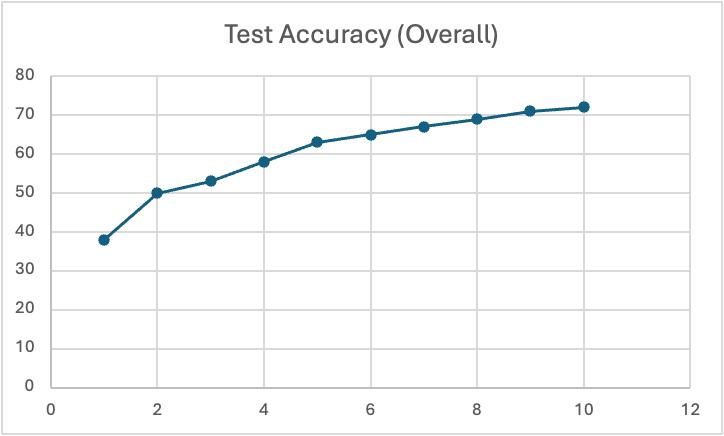
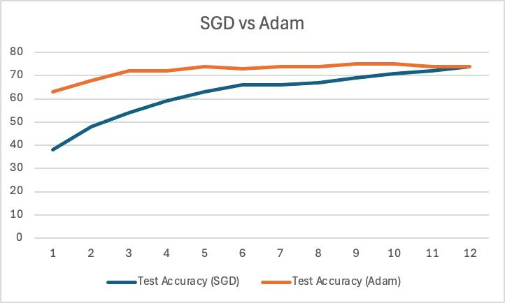
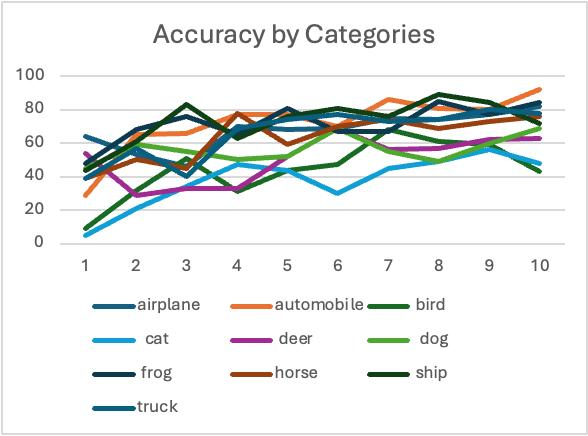

# Assignment 2 CNN Model Training Report

## Overview
This document details the training and evaluation of a Convolutional Neural Network (CNN) on the CIFAR-10 dataset, Using SGD and Adam optimizers and tuning other parameters.

## Model Architecture
```python
Net(
    (conv1): Conv2d(3, 32, kernel_size=(3, 3), stride=(1, 1), padding=(1, 1))
    (conv2): Conv2d(32, 64, kernel_size=(3, 3), stride=(1, 1), padding=(1, 1))
    (conv3): Conv2d(64, 128, kernel_size=(3, 3), stride=(1, 1), padding=(1, 1))
    (pool): MaxPool2d(kernel_size=2, stride=2, padding=0, dilation=1, ceil_mode=False)
    (dropout): Dropout(p=0.25, inplace=False)
    (fc1): Linear(in_features=2048, out_features=512, bias=True)
    (fc2): Linear(in_features=512, out_features=10, bias=True)
)
```

## Training Configuration

### Hardware and Software
- **Hardware**: Apple M3 GPU
- **Framework**: PyTorch
- **Dataset**: CIFAR-10
- **Training Duration**: 12 epochs

### Hyperparameters
- **SGD Optimizer**: Learning rate = 0.01
- **Adam Optimizer**: Learning rate = 0.001
- **Dropout Rate**: 0.25
- **Batch Size**: Standard CIFAR-10 (32)

## Training Results

### Overall Performance
- **Final Test Accuracy**: 75%
- **Final model size**: 4.5 MB
- **Best Performing Categories**: Automobiles, Ships, Airplanes
- **Challenging Categories**: Cats, Dogs, Bird

### Optimizer Comparison

#### Adam vs SGD Performance

- **Initial Accuracy**
  - Adam: ~62%
  - SGD: ~38%
  
- **Final Accuracy**
  - Adam: ~75%
  - SGD: ~74%

- **Convergence Speed**
  - Adam shows faster initial convergence
  - Both optimizers achieve similar final performance

### Loss Analysis
- **Starting Training Loss**: ~2.0
- **Final Training Loss**: ~0.8
- **Validation/Test Loss**: Closely follows training loss
- **Convergence**: Stable decrease across all metrics

### Category-wise Performance

#### High Performance (>75%)
- Automobiles (~85%)
- Ships (~80%)
- Airplanes (~75-80%)


#### Lower Performance (<60%)
- Cats (~45%)
- Dogs (~50%)
- Birds (~65-70%)


## Analysis and Insights

### Strengths
1. Strong performance on rigid, structured objects
2. Good convergence characteristics
3. Minimal overfitting indicated by loss curves
4. Effective learning with both optimizers

### Challenges
1. Inconsistent performance across categories
2. Lower accuracy on natural objects and animals
3. Some categories show high variance in accuracy
4. Slower convergence with SGD

## Recommendations

### Architecture Improvements
1. Add batch normalization layers
2. Implement residual connections
3. Deepen the network architecture
4. Adjust dropout rates

### Training Enhancements
1. Implement learning rate scheduling
2. Continue with Adam optimizer
3. Extend training duration
4. Add class weighting

### Data Processing
1. Enhanced augmentation for challenging classes
2. Balanced sampling strategies
3. Specialized preprocessing for natural objects
4. Additional feature engineering

## Failed Attempts Development

## 1. Model Size Issues
### Oversized Model Architecture
- **Problem**: Initial model was too large (>500 Mb Size)
- **Symptoms**:
  - GPU memory overflow on M3 chip
  - Training time exceeded 5 minutes per epoch
  - Significant overfitting despite dropout
- **Impact**: Unable to complete full training cycle locally
### Undersized Model Architecture
- **Problem**: Attempted minimal model 
- **Symptoms**:
  - Maximum accuracy plateaued at 45%
  - Unable to capture complex features

## 2. Infrastructure Constraints
### Cloud Migration Necessity
- **Local Hardware Limitations**:
  - 8GB RAM constraint
  - M3 GPU memory restrictions
- **Impact on Development**:
  - Limited batch size to 20
  - Forced model size reduction

## 3. Learning Rate Problems
### High Learning Rate Issues
- **Initial Setting**: lr = 0.1
- **Observed Problems**:
  - Training instability
 
## Conclusion
The model demonstrates reasonable performance on the CIFAR-10 dataset, achieving 75% accuracy. While showing strong results for certain categories, there's room for improvement in handling animals.

